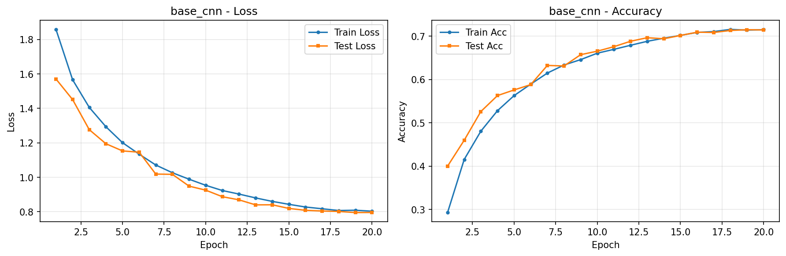
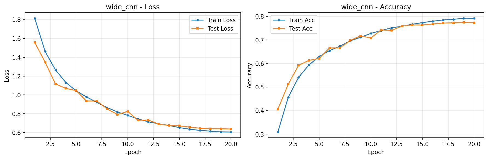
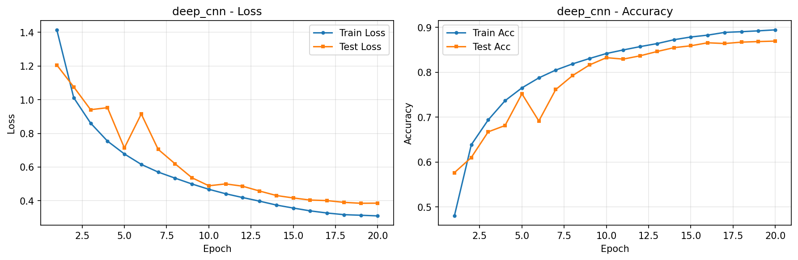
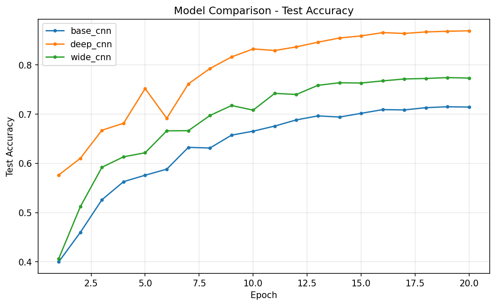

# CIFAR-10 卷積神經網路對比實驗報告

> 專案：`ml-task2-cnn`  
> 實驗日期：2026-06-29  
> 訓練輪數：每模型 20 epoch  
> 一鍵執行命令：`python run_all_experiments.py --epochs 20 --device auto`

---

## 1. 實驗目的

本實驗在 CIFAR-10 資料集上，對比三種不同結構的卷積神經網路（CNN）：

| 模型 | 設計思路 |
|------|----------|
| `base_cnn` | 基礎 CNN：標準深度與通道數 |
| `wide_cnn` | 加寬 CNN：保持深度，增大卷積通道數 |
| `deep_cnn` | 加深 CNN：增加卷積層數，並引入 BatchNorm |

實驗目標：

1. 比較三種結構在分類任務上的性能差異；
2. 記錄訓練過程中的 `train_loss`、`train_acc`、`test_loss`、`test_acc`；
3. 繪製 loss / accuracy 曲線及三模型對比圖；
4. 分析是否存在過擬合或欠擬合現象。

---

## 2. 實驗環境

### 2.1 硬體與系統

| 項目 | 配置 |
|------|------|
| 作業系統 | macOS 26.3.1 (arm64) |
| 處理器架構 | Apple Silicon (M 系列) |
| 加速後端 | MPS (Metal Performance Shaders) |
| MPS 可用 | 是 |

### 2.2 軟體環境

| 工具 / 套件 | 版本 |
|-------------|------|
| Python | 3.10.20 |
| Conda 環境 | `ai` |
| PyTorch | 2.11.0 |
| torchvision | 0.26.0 |
| matplotlib | 3.10.9 |
| pandas | 2.3.3 |
| numpy | 2.2.6 |
| tqdm | 4.67.3 |

### 2.3 開發工具

- IDE：VSCode / Cursor
- 專案路徑：`ml-task2-cnn/`

### 2.4 環境啟用方式

```bash
conda activate ai
cd ml-task2-cnn
pip install -r requirements.txt
```

---

## 3. 資料集

### 3.1 資料集簡介

- **名稱**：CIFAR-10
- **任務**：10 類圖像分類
- **圖像尺寸**：32 × 32 × 3（RGB）
- **類別**：airplane, automobile, bird, cat, deer, dog, frog, horse, ship, truck

### 3.2 資料規模

| 劃分 | 樣本數 |
|------|--------|
| 訓練集 | 50,000 |
| 測試集 | 10,000 |

### 3.3 資料來源與完整性

本實驗使用本地已解壓的 CIFAR-10 官方資料：

```
data/cifar-10-python(加密)/cifar-10-python/cifar-10-batches-py/
```

程式會優先讀取本地資料（`download=False`），已通過官方 MD5 校驗，核心檔案完整：

- `data_batch_1` ~ `data_batch_5`
- `test_batch`
- `batches.meta`

### 3.4 資料預處理

**訓練集增強：**

```python
RandomCrop(32, padding=4)
RandomHorizontalFlip()
ToTensor()
Normalize(mean=(0.4914, 0.4822, 0.4465), std=(0.2023, 0.1994, 0.2010))
```

**測試集：**

```python
ToTensor()
Normalize(mean=(0.4914, 0.4822, 0.4465), std=(0.2023, 0.1994, 0.2010))
```

### 3.5 DataLoader 設定

| 參數 | 值 |
|------|-----|
| batch_size | 128 |
| num_workers | 2 |
| 訓練集 shuffle | True |
| 測試集 shuffle | False |

---

## 4. 實驗方法

### 4.1 模型結構設計

三個模型均基於可配置 CNN（`ConfigurableCNN`），共享以下設計：

- 卷積核大小：3 × 3
- 每個 stage 後接 MaxPool2d(2)
- 特徵提取後使用 AdaptiveAvgPool2d(1, 1)
- 分類器：Linear → ReLU → [Dropout] → Linear(10)

#### 模型 1：base_cnn（基礎 CNN）

| 參數 | 值 |
|------|-----|
| channels | [32, 64, 128] |
| stage_depths | [1, 1, 1] |
| BatchNorm | 否 |
| Dropout | 0.5 |

結構：3 個 stage，每 stage 1 層卷積，共 3 層卷積。

#### 模型 2：wide_cnn（加寬 CNN）

| 參數 | 值 |
|------|-----|
| channels | [64, 128, 256] |
| stage_depths | [1, 1, 1] |
| BatchNorm | 否 |
| Dropout | 0.5 |

結構：與 base_cnn 深度相同，但通道數加倍，參數量更大。

#### 模型 3：deep_cnn（加深 CNN）

| 參數 | 值 |
|------|-----|
| channels | [32, 64, 128] |
| stage_depths | [2, 2, 2] |
| BatchNorm | 是 |
| Dropout | 0.5 |

結構：3 個 stage，每 stage 2 層卷積，共 6 層卷積，並在每層卷積後使用 BatchNorm。

### 4.2 訓練超參數

| 參數 | 值 |
|------|-----|
| 優化器 | Adam |
| 學習率 (lr) | 0.001 |
| 損失函數 | CrossEntropyLoss |
| 學習率調度 | CosineAnnealingLR (T_max=20) |
| 訓練輪數 (epochs) | 20 |
| 裝置 (device) | auto → mps |

### 4.3 評估指標

每個 epoch 記錄：

- `train_loss`：訓練集平均損失
- `train_acc`：訓練集準確率
- `test_loss`：測試集平均損失
- `test_acc`：測試集準確率

指標含義：

- **loss 越低**：模型預測錯誤越少
- **accuracy 越高**：模型答對越多

### 4.4 實驗流程

```bash
cd ml-task2-cnn
python run_all_experiments.py --epochs 20 --device auto
```

自動執行步驟：

1. 依序訓練 `base_cnn`、`wide_cnn`、`deep_cnn`（各 20 epoch）
2. 保存每輪訓練日誌至 `outputs/logs/`
3. 保存最佳模型權重至 `outputs/models/`
4. 對最佳模型進行測試集評估
5. 生成每模型曲線圖與三模型對比圖
6. 匯總指標至 `outputs/logs/experiment_summary.csv`

---

## 5. 訓練過程詳細記錄

### 5.1 base_cnn（基礎 CNN）

| Epoch | train_loss | train_acc | test_loss | test_acc | 耗時(s) |
|-------|------------|-----------|-----------|----------|---------|
| 1 | 1.8585 | 29.28% | 1.5707 | 39.99% | 29.93 |
| 2 | 1.5662 | 41.54% | 1.4510 | 45.98% | 29.80 |
| 3 | 1.4059 | 48.06% | 1.2766 | 52.61% | 29.77 |
| 4 | 1.2936 | 52.80% | 1.1949 | 56.29% | 29.77 |
| 5 | 1.2010 | 56.29% | 1.1530 | 57.60% | 29.67 |
| 6 | 1.1343 | 58.94% | 1.1457 | 58.83% | 29.41 |
| 7 | 1.0712 | 61.49% | 1.0186 | 63.26% | 29.37 |
| 8 | 1.0263 | 63.35% | 1.0170 | 63.13% | 29.78 |
| 9 | 0.9888 | 64.60% | 0.9486 | 65.74% | 29.77 |
| 10 | 0.9535 | 66.08% | 0.9254 | 66.55% | 29.89 |
| 11 | 0.9232 | 66.97% | 0.8873 | 67.59% | 29.44 |
| 12 | 0.9026 | 67.91% | 0.8691 | 68.84% | 29.83 |
| 13 | 0.8802 | 68.83% | 0.8398 | 69.66% | 29.80 |
| 14 | 0.8600 | 69.55% | 0.8403 | 69.42% | 29.44 |
| 15 | 0.8431 | 70.20% | 0.8192 | 70.18% | 29.57 |
| 16 | 0.8274 | 70.88% | 0.8083 | 70.93% | 29.78 |
| 17 | 0.8172 | 71.07% | 0.8042 | 70.87% | 29.45 |
| 18 | 0.8071 | 71.58% | 0.8016 | 71.33% | 29.84 |
| 19 | 0.8088 | 71.42% | 0.7951 | **71.51%** | 29.90 |
| 20 | 0.8030 | 71.51% | 0.7957 | 71.45% | 29.63 |

- 總訓練耗時：約 **597 秒（~10 分鐘）**
- 最佳測試準確率：**71.51%**（第 19 輪）

---

### 5.2 wide_cnn（加寬 CNN）

| Epoch | train_loss | train_acc | test_loss | test_acc | 耗時(s) |
|-------|------------|-----------|-----------|----------|---------|
| 1 | 1.8146 | 30.93% | 1.5577 | 40.66% | 33.14 |
| 2 | 1.4626 | 45.64% | 1.3483 | 51.20% | 33.50 |
| 3 | 1.2668 | 54.09% | 1.1177 | 59.21% | 33.70 |
| 4 | 1.1333 | 59.34% | 1.0702 | 61.34% | 33.54 |
| 5 | 1.0438 | 62.98% | 1.0468 | 62.16% | 33.25 |
| 6 | 0.9796 | 65.47% | 0.9361 | 66.62% | 33.29 |
| 7 | 0.9216 | 67.34% | 0.9368 | 66.65% | 33.95 |
| 8 | 0.8658 | 69.57% | 0.8527 | 69.74% | 33.78 |
| 9 | 0.8199 | 71.12% | 0.7924 | 71.76% | 33.42 |
| 10 | 0.7826 | 72.76% | 0.8256 | 70.83% | 33.28 |
| 11 | 0.7449 | 73.97% | 0.7303 | 74.23% | 33.33 |
| 12 | 0.7146 | 75.13% | 0.7342 | 74.01% | 33.52 |
| 13 | 0.6932 | 75.78% | 0.6897 | 75.87% | 34.02 |
| 14 | 0.6757 | 76.63% | 0.6769 | 76.39% | 33.62 |
| 15 | 0.6531 | 77.35% | 0.6723 | 76.34% | 33.31 |
| 16 | 0.6361 | 77.93% | 0.6585 | 76.77% | 33.70 |
| 17 | 0.6230 | 78.47% | 0.6466 | 77.16% | 34.47 |
| 18 | 0.6156 | 78.74% | 0.6424 | 77.26% | 33.90 |
| 19 | 0.6073 | 79.19% | 0.6415 | **77.44%** | 33.48 |
| 20 | 0.6059 | 79.12% | 0.6378 | 77.34% | 33.87 |

- 總訓練耗時：約 **673 秒（~11 分鐘）**
- 最佳測試準確率：**77.44%**（第 19 輪）

---

### 5.3 deep_cnn（加深 CNN）

| Epoch | train_loss | train_acc | test_loss | test_acc | 耗時(s) |
|-------|------------|-----------|-----------|----------|---------|
| 1 | 1.4141 | 48.03% | 1.2054 | 57.65% | 35.37 |
| 2 | 1.0117 | 63.86% | 1.0757 | 61.03% | 35.03 |
| 3 | 0.8609 | 69.39% | 0.9405 | 66.74% | 34.99 |
| 4 | 0.7540 | 73.68% | 0.9523 | 68.15% | 35.28 |
| 5 | 0.6779 | 76.54% | 0.7134 | 75.21% | 34.94 |
| 6 | 0.6159 | 78.76% | 0.9150 | 69.16% | 36.22 |
| 7 | 0.5703 | 80.50% | 0.7052 | 76.16% | 35.28 |
| 8 | 0.5344 | 81.88% | 0.6196 | 79.28% | 35.30 |
| 9 | 0.4997 | 83.08% | 0.5367 | 81.64% | 35.07 |
| 10 | 0.4682 | 84.19% | 0.4891 | 83.26% | 35.43 |
| 11 | 0.4416 | 84.98% | 0.5001 | 82.94% | 35.19 |
| 12 | 0.4193 | 85.73% | 0.4865 | 83.68% | 34.97 |
| 13 | 0.3978 | 86.40% | 0.4579 | 84.63% | 35.27 |
| 14 | 0.3746 | 87.26% | 0.4312 | 85.49% | 34.92 |
| 15 | 0.3569 | 87.87% | 0.4168 | 85.91% | 35.28 |
| 16 | 0.3401 | 88.28% | 0.4043 | 86.58% | 35.25 |
| 17 | 0.3275 | 88.89% | 0.4012 | 86.41% | 35.13 |
| 18 | 0.3176 | 89.05% | 0.3906 | 86.72% | 35.29 |
| 19 | 0.3141 | 89.24% | 0.3852 | 86.85% | 35.23 |
| 20 | 0.3103 | 89.46% | 0.3859 | **86.95%** | 35.44 |

- 總訓練耗時：約 **705 秒（~12 分鐘）**
- 最佳測試準確率：**86.95%**（第 20 輪）

---

## 6. 實驗結果

### 6.1 三模型總體對比

| 模型 | 最終 train_acc | 最終 test_acc | 最佳 test_acc | 最佳 epoch | train-test 差距 |
|------|----------------|---------------|---------------|------------|-----------------|
| base_cnn | 71.51% | 71.45% | **71.51%** | 19 | 0.06% |
| wide_cnn | 79.12% | 77.34% | **77.44%** | 19 | 1.78% |
| deep_cnn | 89.46% | 86.95% | **86.95%** | 20 | 2.51% |

**結論**：`deep_cnn` > `wide_cnn` > `base_cnn`，加深並引入 BatchNorm 的模型表現最好。

### 6.2 各類別測試準確率（最佳模型）

#### base_cnn（整體 71.51%）

| 類別 | 準確率 |
|------|--------|
| airplane | 74.40% |
| automobile | 84.20% |
| bird | 54.90% |
| cat | 44.00% |
| deer | 69.60% |
| dog | 64.40% |
| frog | 79.10% |
| horse | 75.00% |
| ship | 86.00% |
| truck | 83.50% |

#### wide_cnn（整體 77.44%）

| 類別 | 準確率 |
|------|--------|
| airplane | 81.70% |
| automobile | 89.20% |
| bird | 64.90% |
| cat | 57.60% |
| deer | 76.00% |
| dog | 69.40% |
| frog | 82.30% |
| horse | 82.50% |
| ship | 86.40% |
| truck | 84.40% |

#### deep_cnn（整體 86.95%）

| 類別 | 準確率 |
|------|--------|
| airplane | 88.10% |
| automobile | 95.60% |
| bird | 83.30% |
| cat | 70.50% |
| deer | 86.30% |
| dog | 81.30% |
| frog | 90.20% |
| horse | 88.30% |
| ship | 94.10% |
| truck | 91.80% |

**觀察**：

- 三個模型在 `cat`、`bird` 等細粒度類別上普遍較弱；
- `automobile`、`ship`、`truck` 等結構較規則的類別表現較好；
- `deep_cnn` 在所有類別上均優於另外兩個模型。

### 6.3 訓練曲線圖

#### 各模型 Loss / Accuracy 曲線







#### 三模型 Test Accuracy 對比



---

## 7. 過擬合與欠擬合分析

### 7.1 判斷標準

| 現象 | 表現 | 含義 |
|------|------|------|
| **過擬合** | 訓練準確率高，測試準確率低；或訓練 loss 下降但測試 loss 上升 | 模型「背會」訓練集，泛化差 |
| **欠擬合** | 訓練與測試準確率都低 | 模型太簡單，連訓練集都沒學好 |
| **良好擬合** | 訓練與測試準確率接近，且測試指標持續改善或穩定 | 模型泛化能力好 |

### 7.2 各模型分析

#### base_cnn

- 最終：train_acc = 71.51%，test_acc = 71.45%，差距僅 **0.06%**
- 訓練過程中 train_loss 與 test_loss 同步下降
- **結論**：**良好擬合，無明顯過擬合或欠擬合**。模型容量適中，但整體性能有限。

#### wide_cnn

- 最終：train_acc = 79.12%，test_acc = 77.34%，差距 **1.78%**
- 第 10 輪出現 test_acc 短暫回落（70.83%），之後恢復上升
- train_acc 始終高於 test_acc，但差距不大
- **結論**：存在**輕微過擬合傾向**，但整體可控。加寬通道提升了模型表現力。

#### deep_cnn

- 最終：train_acc = 89.46%，test_acc = 86.95%，差距 **2.51%**
- 第 6 輪 test_acc 從 75.21% 跌至 69.16%（訓練過程中的波動），之後持續上升
- 第 20 輪 test_acc 仍為最高值，說明模型尚未飽和
- **結論**：存在**輕微過擬合**（train-test 差距約 2.5%），但測試集性能仍在提升，整體表現最佳。BatchNorm 和 Dropout 起到了一定正則化作用。

### 7.3 綜合結論

| 模型 | 擬合狀態 | 說明 |
|------|----------|------|
| base_cnn | 良好擬合 | 容量不足，性能最低 |
| wide_cnn | 輕微過擬合 | 加寬有效提升性能 |
| deep_cnn | 輕微過擬合 | 性能最好，仍有提升空間 |

三個模型均**未出現嚴重欠擬合**（第 1 輪準確率較低屬正常，20 輪後均已充分學習）。

---

## 8. 實驗結論

1. **結構影響明顯**：在相同訓練設定下，`deep_cnn`（86.95%）> `wide_cnn`（77.44%）> `base_cnn`（71.51%）。
2. **加深優於加寬**：`deep_cnn` 通過增加卷積層數並引入 BatchNorm，獲得了最大的性能提升。
3. **加寬有效**：`wide_cnn` 相比 `base_cnn` 提升了約 6 個百分點，證明增大通道數能提升表達能力。
4. **訓練穩定**：三模型在 20 輪內 loss 持續下降、accuracy 持續上升，訓練過程穩定。
5. **無嚴重過擬合**：三模型 train-test 差距均在 3% 以內，正則化（Dropout、BatchNorm、資料增強）效果良好。

---

## 9. 產出檔案清單

```
ml-task2-cnn/
├── outputs/
│   ├── logs/
│   │   ├── base_cnn_train_log.csv      # base_cnn 逐輪訓練日誌
│   │   ├── wide_cnn_train_log.csv      # wide_cnn 逐輪訓練日誌
│   │   ├── deep_cnn_train_log.csv      # deep_cnn 逐輪訓練日誌
│   │   ├── base_cnn_eval_report.txt    # base_cnn 評估報告
│   │   ├── wide_cnn_eval_report.txt    # wide_cnn 評估報告
│   │   ├── deep_cnn_eval_report.txt    # deep_cnn 評估報告
│   │   └── experiment_summary.csv      # 三模型指標匯總
│   ├── models/
│   │   ├── base_cnn_best.pth           # base_cnn 最佳權重
│   │   ├── wide_cnn_best.pth           # wide_cnn 最佳權重
│   │   └── deep_cnn_best.pth           # deep_cnn 最佳權重
│   └── figures/
│       ├── base_cnn_curves.png         # base_cnn loss/acc 曲線
│       ├── wide_cnn_curves.png         # wide_cnn loss/acc 曲線
│       ├── deep_cnn_curves.png         # deep_cnn loss/acc 曲線
│       └── compare_test_acc.png        # 三模型 test_acc 對比
└── REPORT.md                           # 本報告
```

---

## 10. 復現方式

```bash
# 1. 啟用環境
conda activate ai

# 2. 進入專案
cd ml-task2-cnn

# 3. 一鍵跑完整實驗（20 輪）
python run_all_experiments.py --epochs 20 --device auto

# 4. 查看結果
cat outputs/logs/experiment_summary.csv
open outputs/figures/compare_test_acc.png
```

---

*報告由實驗腳本自動產出的日誌與評估結果整理而成。*
